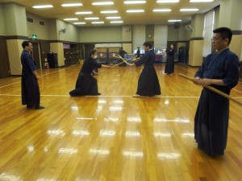
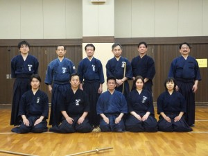

寒の戻りから時折、春の陽気が顔をのぞかせた3月8日の日曜日。尼崎市園田体育館で今年初めてとなる「一の会」稽古が、久田先生の指導の下行われました。今回の日程は一日だけとあって、午前中は制定杖道、短杖術、午後からは神道夢想流剣術、古流杖術と普段より盛りだくさんの内容になりました。終わった後は、JR尼崎駅前の居酒屋で恒例の反省会兼飲み会を行い、先生を囲んで歓談。充実した一日となりました。

   [   ](002.jpg)

