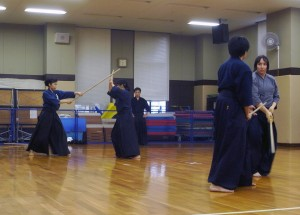
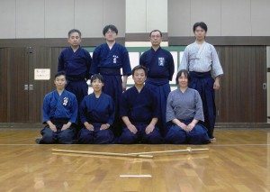

神奈川から久田先生を招いての恒例の一の会の稽古会を12、13日、尼崎市内の立花、園田体育館で行いました。12日の早朝５時に東京湾を震源とする最大震度５弱の地震がありましたが、久田先生「すわ、来たか」と目が覚めたそうで、そのまま新幹線で関西まで駆けつけていただきました。 今回は諸事情で参加者が少なく、その分、中身の濃い稽古になったと思います。古流にせよ制定にせよ、技の理合をきちっと理解して、正しい動作を丹念に身につける。その大切さを改めて感じました。次回の稽古会まで更にステップアップできるよう精進、また精進です。

