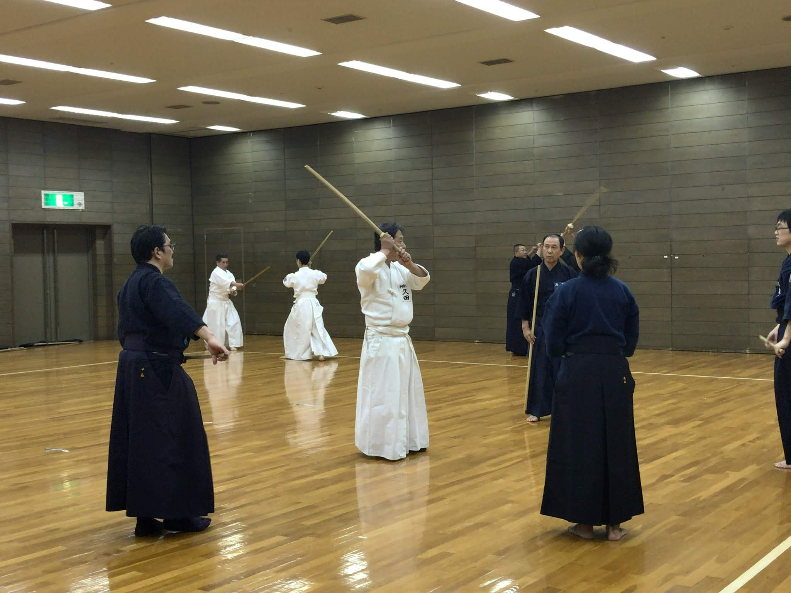
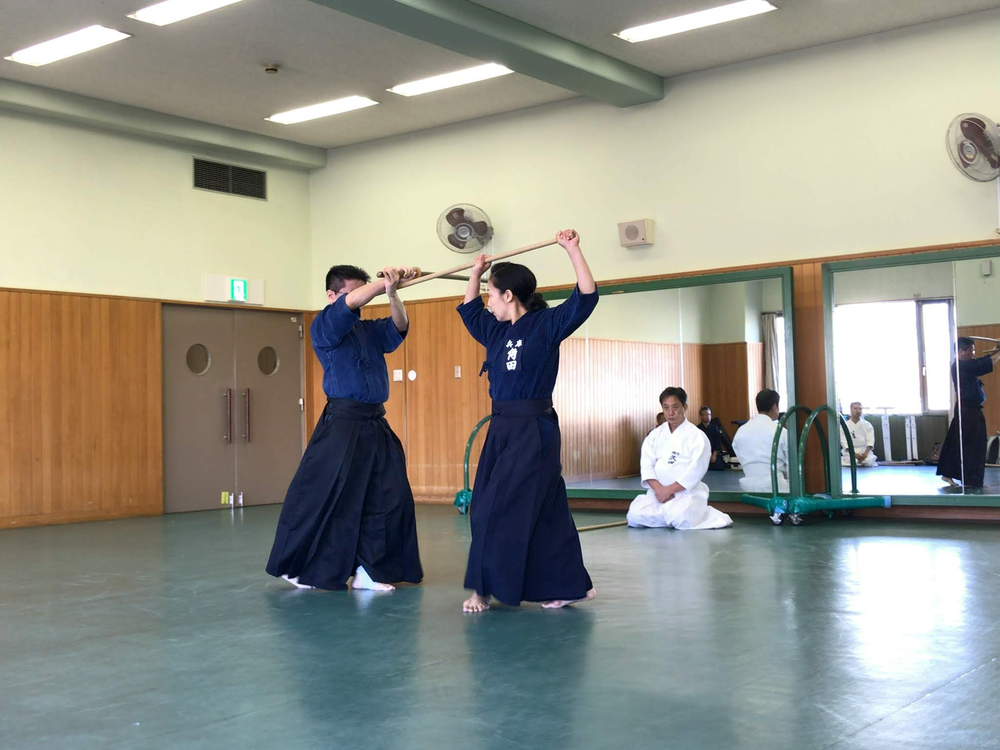
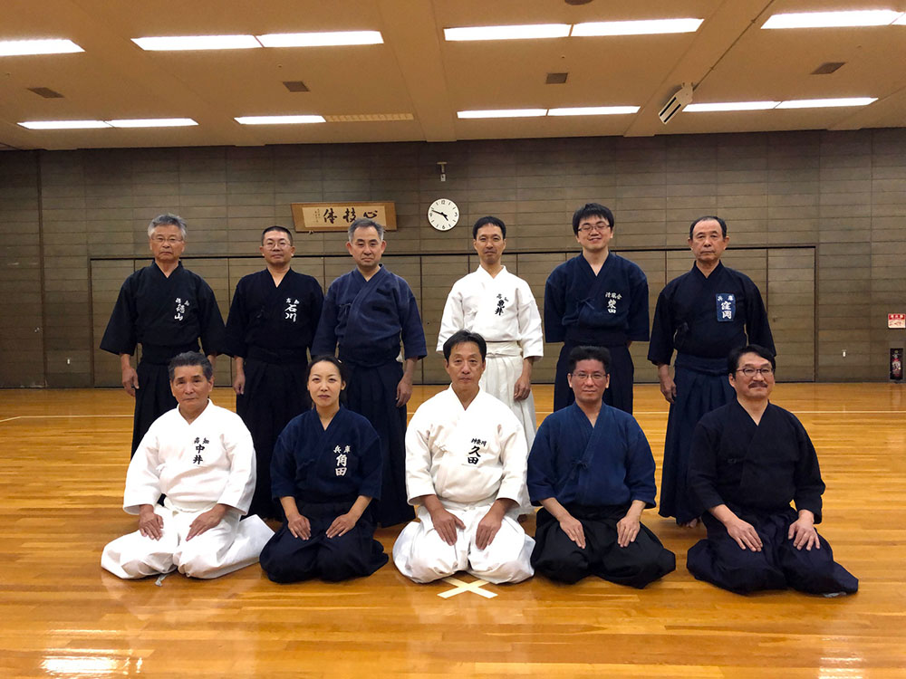

久田師範指導の下で恒例の「一の会」稽古を17、18日に尼崎のベイコム体育館、中央体育館で行いました。今回は久田師範の故郷である高知と徳島からの参加者もあり、新規入門されて古流の稽古を始められた方もいて、今まで以上に賑やかな雰囲気となりました。当会の年配者にとって2日間の密度の高い稽古は結構身体にこたえるものですが、年数回の頻度しかない稽古会だけに、それぞれ精一杯に身体を動かし、汗を流していました。

