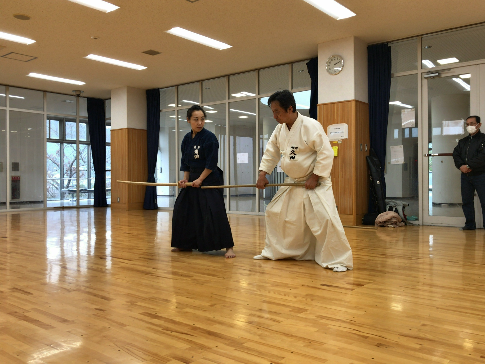

スギ花粉の飛散もたけなわの3月第2週の土日（３／9〜3/10）、神奈川から久田師範に来ていただき、恒例の「一の会」稽古が行われました。今回の稽古場所は、土曜日が尼崎市ベイコム体育館、日曜日が西宮市名塩体育館でした。前回に引き続き徳島、高知から来られた熱心な参加者もおられ、個々の習得度に応じた古流杖術中心の稽古に励みました。また、今年5月の京都武道大会杖部門に久田師範と角田六段が演武するので、その技合わせも稽古の合間にされておりました。

  
